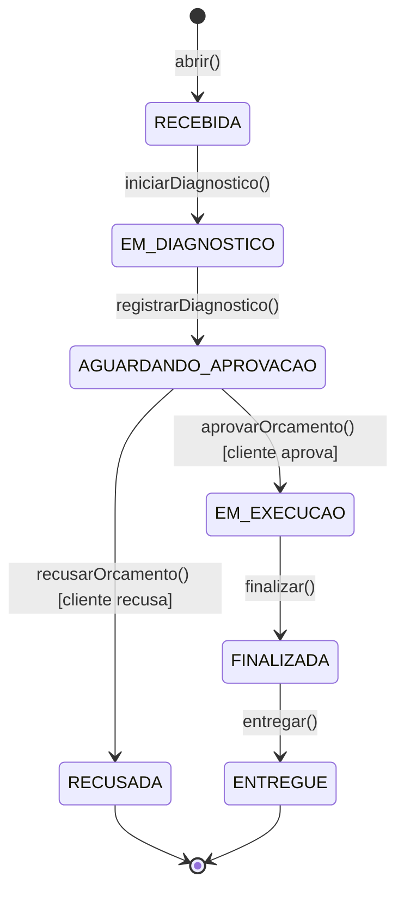

# Oficina Mecânica — Sistema Integrado de Atendimento e Execução de Serviços

Tech Challenge (POS TECH / SOAT) — **Fases 1, 2 e 3**. Back-end de gestão de clientes,
veículos, catálogo de serviços/peças e ordens de serviço (OS) de uma oficina mecânica,
aplicando **Domain-Driven Design**/Arquitetura Hexagonal, autenticação JWT (admin e
cliente via Function Serverless), testes automatizados, containerização, Kubernetes,
Terraform, CI/CD, infraestrutura em nuvem (AWS) e observabilidade (New Relic).

Este é o repositório 4 de 4 do Tech Challenge — a aplicação principal. Os outros três
(`oficina-lambda-auth`, `oficina-infra-k8s`, `oficina-infra-db`) estão descritos na
seção [Fase 3](#fase-3--operação-corporativa-nuvem-real-4-repositórios) abaixo.

## Deploy ativo (Fase 3 — AWS real)

> A infraestrutura de nuvem é provisionada sob demanda, para não manter custo
> ocioso entre usos — se os links abaixo não responderem, o ambiente está
> desligado. Ver "Ordem de provisionamento" abaixo para reaplicar.

- **API + Swagger**: http://ae65deff85359470e8d2de969410d562-2eac41316cad19f3.elb.us-east-1.amazonaws.com/docs
- **Health check**: http://ae65deff85359470e8d2de969410d562-2eac41316cad19f3.elb.us-east-1.amazonaws.com/health
- **Login do cliente por CPF (Function Serverless)**: `POST https://wq5yeux4ge.execute-api.us-east-1.amazonaws.com/auth/cliente` — ver [`oficina-lambda-auth`](https://github.com/RafaelNikolasPuggi/oficina-lambda-auth).

## Objetivo

Substituir o controle manual (planilhas/anotações) por um sistema único que permita:

- Abrir uma OS identificando cliente (CPF/CNPJ) e veículo, com os serviços/peças solicitados.
- Acompanhar o status da OS em tempo real (`Recebida → Em diagnóstico → Aguardando aprovação → Em execução → Finalizada → Entregue`, com `Recusada` como desfecho alternativo).
- Gerar o orçamento automaticamente, notificar o cliente por e-mail e permitir que ele aprove ou recuse.
- Gerir o catálogo de clientes, veículos, serviços e peças, com controle de estoque.
- Medir o tempo médio de execução das OS finalizadas.
- **(Fase 2)** Suportar picos de demanda com escalabilidade dinâmica (HPA), com
  provisionamento e deploy automatizados (Terraform + CI/CD).
- **(Fase 3)** Autenticar o cliente por CPF via uma Function Serverless dedicada,
  rodar em infraestrutura de nuvem gerenciada (EKS + RDS) e dar visibilidade
  operacional via observabilidade (APM, logs estruturados, dashboards).

## Stack e justificativas técnicas

| Decisão | Motivo |
|---|---|
| **NestJS + TypeScript** | Estrutura modular que mapeia naturalmente para bounded contexts DDD, injeção de dependência nativa, Jest integrado. |
| **PostgreSQL + TypeORM** | O domínio é fortemente relacional (Cliente → Veículo → OS → Itens de Serviço/Peça) e depende de integridade referencial e transações ACID — em especial a baixa de estoque ao aprovar um orçamento, que precisa ser atômica mesmo sob concorrência (duas OS disputando a mesma peça). Postgres é gratuito, robusto, e tem ótimo suporte a Docker. |
| **JWT (`@nestjs/jwt` + Passport)** | Autenticação stateless para as rotas administrativas, conforme exigido pelo desafio. |
| **class-validator** | Validação declarativa dos DTOs, incluindo validadores customizados de CPF/CNPJ (dígito verificador) e placa (formato antigo e Mercosul). |
| **Swagger (`@nestjs/swagger`)** | Documentação OpenAPI gerada a partir do próprio código, sempre atualizada. |
| **Jest + Supertest** | Testes unitários (domínio/aplicação) e de integração (e2e, contra Postgres real). |
| **Nodemailer + Mailhog** | Notificação por e-mail das mudanças de status da OS; Mailhog captura os e-mails localmente/CI sem precisar de conta SMTP real. |
| **Kubernetes + Terraform (Fase 2)** | Escalabilidade dinâmica (HPA) e infraestrutura versionada/reprodutível; cluster local (kind) para não depender de custo de nuvem — ver [`docs/architecture.md`](docs/architecture.md). |
| **GitHub Actions (Fase 2)** | Pipeline única cobrindo build, testes, build/push da imagem, provisionamento (Terraform) e deploy (kubectl) — sem exigir conta de nuvem. |
| **AWS EKS + RDS (Fase 3)** | Cluster Kubernetes e banco gerenciados de verdade, provisionados por repositórios Terraform separados — ver [ADR 0001](docs/adr/0001-nuvem-aws.md)/[ADR 0002](docs/adr/0002-banco-gerenciado-rds.md). |
| **Lambda + API Gateway (Fase 3)** | Autenticação de clientes por CPF, desacoplada do app principal — repositório `oficina-lambda-auth`, ver [ADR 0003](docs/adr/0003-autenticacao-serverless.md). |
| **New Relic (agente Node.js + `nri-bundle` no Kubernetes) (Fase 3)** | APM, logs estruturados correlacionados e métricas de infraestrutura — ver [`docs/observability.md`](docs/observability.md). |

## Arquitetura

O projeto é um **monolito em Arquitetura Hexagonal (Ports & Adapters)**, organizado por
módulo (bounded context) — ver [`docs/architecture.md`](docs/architecture.md) para o
mapeamento completo das camadas e o diagrama de componentes. Resumo da estrutura de
pastas, repetida em cada módulo de negócio:

```
src/
  shared/                     Kernel compartilhado: Entity base, Value Objects (CPF/CNPJ, Placa),
                               exceções de domínio, filtro HTTP, validadores customizados.
  config/                     Configuração de ambiente e DataSource do TypeORM.
  modules/
    auth/                     Login administrativo, estratégia JWT, guard.
    clientes/                 domain / application / infrastructure / interfaces (http)
    veiculos/                 idem
    servicos/                 idem (catálogo de serviços)
    pecas/                    idem (catálogo + controle de estoque)
    ordens-servico/           Agregado central: máquina de estados da OS, orçamento,
                               orquestração da baixa de estoque.
```

Em cada módulo:

- **domain/** — entidades e Value Objects com as regras de negócio e invariantes; não depende de framework nem de banco.
- **application/** — casos de uso (services) que orquestram o domínio e os repositórios; ponto único onde a lógica de negócio é acionada.
- **infrastructure/** — implementação dos repositórios com TypeORM (mapeamento domínio ↔ tabela).
- **interfaces/http/** — controllers, DTOs e validação — a única camada que conhece HTTP/Swagger.

A regra de dependência é sempre **de fora para dentro**: `interfaces` depende de
`application`, que depende de `domain`; `infrastructure` implementa interfaces definidas
pelo `domain` (Dependency Inversion — cada módulo expõe um token de injeção, ex.
`CLIENTE_REPOSITORY`, e o domínio nunca importa TypeORM).

### Agregado `OrdemServico`

O coração do domínio. Toda transição de status passa exclusivamente pelos métodos da
entidade (`iniciarDiagnostico`, `registrarDiagnostico`, `aprovarOrcamento`,
`recusarOrcamento`, `finalizar`, `entregar`), que validam a máquina de estados e
recalculam o orçamento — garantindo que a OS nunca fique em um estado inconsistente,
independente de qual camada aciona a transição.



A baixa de estoque das peças ocorre de forma **transacional e atômica** no momento da
aprovação do orçamento (`PecaRepository.decrementarEstoqueTransacional`), usando um
`UPDATE ... WHERE quantidade_estoque >= :quantidade` dentro de uma transação — se o
estoque não for suficiente no exato momento da aprovação (por concorrência com outra
OS), a operação inteira é revertida e uma `InsufficientStockException` é lançada.

### Segurança

- Rotas administrativas (CRUD de clientes/veículos/serviços/peças, gestão de OS) exigem
  `Authorization: Bearer <JWT admin>` (`JwtAuthGuard`).
- **(Fase 3)** Rotas voltadas ao cliente final (`GET /ordens-servico/:id/status`,
  `POST /ordens-servico/:id/aprovacao`) exigem `Authorization: Bearer <JWT cliente>`
  (`ClienteAuthGuard`), emitido pela Function Serverless de autenticação por CPF do
  repositório `oficina-lambda-auth` (`POST {api_endpoint}/auth/cliente`) — o
  `clienteId` vem do token, não mais de um parâmetro solto (Fases 1/2). Rate limiting
  dedicado nessas duas rotas.
- Senhas de usuários administrativos são armazenadas com `bcrypt`.
- `helmet` + CORS habilitados; `ValidationPipe` global com `whitelist`/`forbidNonWhitelisted`.
- CPF/CNPJ e placa validados por algoritmo (dígito verificador / formato), não apenas por regex solto.

## Executando localmente

### Com Docker (recomendado)

```bash
cp .env.example .env
docker-compose up --build
```

A aplicação sobe em `http://localhost:3000`, com o Postgres em `localhost:5432`.
Documentação interativa (Swagger) em **http://localhost:3000/docs**; e-mails de
notificação capturados pelo Mailhog em **http://localhost:8025**.

Crie o usuário administrativo inicial (necessário para obter um JWT). O script de seed
roda localmente via `ts-node`, apontando para o Postgres exposto pelo compose na porta
5432:

```bash
DB_HOST=localhost ADMIN_EMAIL=admin@oficina.com ADMIN_PASSWORD=admin123 npm run seed:admin
```

### Sem Docker

Pré-requisitos: Node.js 20+, PostgreSQL 16 rodando localmente.

```bash
npm install
cp .env.example .env   # ajuste DB_HOST/DB_USERNAME/DB_PASSWORD conforme seu Postgres local
npm run seed:admin     # cria o usuário administrativo inicial
npm run start:dev
```

A aplicação usa `synchronize: true` por padrão (não há migrations neste MVP) — o schema
é criado automaticamente a partir das entidades na primeira execução. Controlado pela
flag `TYPEORM_SYNCHRONIZE` (não por `NODE_ENV`, já que o deploy em Kubernetes também
roda com `NODE_ENV=production` e ainda depende do synchronize); defina
`TYPEORM_SYNCHRONIZE=false` somente depois de introduzir migrations reais.

### Autenticando

```bash
curl -X POST http://localhost:3000/auth/login \
  -H "Content-Type: application/json" \
  -d '{"email":"admin@oficina.com","senha":"admin123"}'
```

Use o `accessToken` retornado no header `Authorization: Bearer <token>` das chamadas
administrativas.

## Testes

```bash
npm test            # testes unitários (domínio + aplicação, com mocks)
npm run test:cov    # idem, com relatório de cobertura
npm run test:e2e    # testes de integração (requer Postgres — ex.: docker-compose up -d postgres)
```

Cobertura nos domínios críticos indicados pelo desafio (`ordens-servico` e `pecas`,
apenas `domain` + `application`, sem contar infraestrutura/HTTP): **acima de 95%** —
acima do mínimo de 80% exigido.

## Documentação complementar

- [`docs/ddd/`](docs/ddd) — Event Storming (fluxos de criação/acompanhamento da OS e
  gestão de peças/insumos) e Linguagem Ubíqua.
- [`docs/architecture.md`](docs/architecture.md) — Arquitetura Hexagonal, fluxo de
  deploy, diagrama de componentes (visão de nuvem completa) e diagrama de sequência
  (autenticação + abertura de OS).
- [`docs/security/vulnerability-report.md`](docs/security/vulnerability-report.md) —
  relatório de análise de vulnerabilidades (`npm audit` + práticas adotadas).
- [`docs/database/modelo-er.md`](docs/database/modelo-er.md) — diagrama ER e
  justificativa formal do banco gerenciado.
- [`docs/observability.md`](docs/observability.md) — o que está instrumentado
  (APM, logs estruturados, correlação) e o que configurar no New Relic.
- [`docs/adr/`](docs/adr) e [`docs/rfc/`](docs/rfc) — decisões arquiteturais e as
  alternativas consideradas (nuvem, banco gerenciado, autenticação serverless, HPA,
  integração entre os 4 repositórios).
- [`infra/README.md`](infra/README.md) — o que o Terraform provisiona e como aplicar
  (cluster kind local, Fase 2).
- Swagger: `/docs` na aplicação em execução.

## Principais endpoints

| Método | Rota | Acesso | Descrição |
|---|---|---|---|
| POST | `/auth/login` | público | Autentica um usuário administrativo |
| POST/GET/PATCH/DELETE | `/clientes[/:id]` | JWT | CRUD de clientes |
| POST/GET/PATCH/DELETE | `/veiculos[/:id]` | JWT | CRUD de veículos |
| POST/GET/PATCH/DELETE | `/servicos[/:id]` | JWT | CRUD do catálogo de serviços |
| POST/GET/PATCH/DELETE | `/pecas[/:id]` | JWT | CRUD do catálogo de peças + estoque |
| PATCH | `/pecas/:id/estoque` | JWT | Ajuste manual de estoque |
| POST | `/ordens-servico` | JWT | Abre uma nova OS |
| GET | `/ordens-servico` | JWT | Lista OS (paginado) — ver comportamento abaixo |
| GET | `/ordens-servico/:id` | JWT | Detalhamento completo da OS |
| PATCH | `/ordens-servico/:id/iniciar-diagnostico` | JWT | Inicia o diagnóstico |
| PATCH | `/ordens-servico/:id/diagnostico` | JWT | Registra diagnóstico e gera orçamento |
| PATCH | `/ordens-servico/:id/finalizar` | JWT | Finaliza a execução |
| PATCH | `/ordens-servico/:id/entregar` | JWT | Marca como entregue |
| GET | `/ordens-servico/metricas/tempo-medio` | JWT | Tempo médio de execução |
| GET | `/ordens-servico/:id/status` | JWT cliente* | Cliente consulta o status da OS |
| POST | `/ordens-servico/:id/aprovacao` | JWT cliente* | Cliente aprova/recusa o orçamento |

\* JWT emitido por `POST {api_endpoint}/auth/cliente` no repositório
`oficina-lambda-auth` (Fase 3) — ver seção Segurança.

**Comportamento de `GET /ordens-servico` (Fase 2):** sem o parâmetro `status`, aplica a
listagem operacional — oculta OS `Finalizada`/`Entregue` (exclusão lógica) e ordena por
prioridade: `Em Execução > Aguardando Aprovação > Em Diagnóstico > Recebida`, mais
antigas primeiro dentro de cada grupo. Com `status` informado, filtra exatamente por
ele (permite consultar o histórico de OS finalizadas/entregues).

**Notificação por e-mail (Fase 2):** a cada mudança de status, o cliente recebe um
e-mail (Nodemailer). Localmente/CI isso é capturado pelo Mailhog — UI em
`http://localhost:8025` — sem precisar de conta de e-mail real; uma falha no envio
nunca reverte a transição de status já persistida.

Especificação completa e testável: `/docs` (Swagger UI) na aplicação em execução.

## Kubernetes, Terraform e CI/CD (Fase 2)

Visão geral do fluxo completo, diagramas e decisões em
[`docs/architecture.md`](docs/architecture.md#fluxo-de-deploy-fase-2).

### Provisionar a infraestrutura (Terraform)

Cria o cluster Kubernetes local (kind) e o banco de dados (Postgres) dentro dele —
detalhes e recursos criados em [`infra/README.md`](infra/README.md).

```bash
cd infra
terraform init
terraform apply
export KUBECONFIG=$(terraform output -raw kubeconfig_path)
```

### Deploy da aplicação (Kubernetes)

```bash
kubectl apply -f k8s/00-namespace.yaml -f k8s/01-configmap.yaml -f k8s/04-service.yaml -f k8s/05-hpa.yaml -f k8s/06-mailhog.yaml
kubectl create secret generic oficina-app-secret -n oficina \
  --from-literal=DB_USERNAME=oficina --from-literal=DB_PASSWORD=oficina \
  --from-literal=JWT_SECRET='<segredo-forte>'
kubectl apply -f k8s/03-deployment.yaml   # ajuste a imagem antes, ver comentário no arquivo
kubectl -n oficina rollout status deployment/oficina-app
```

Manifestos completos e o porquê de cada um: [`/k8s`](k8s). Nunca commite
`k8s/02-secret.yaml` com valores reais — use `k8s/02-secret.yaml.example` como
referência (já ignorado pelo git).

### CI/CD (GitHub Actions)

[`/.github/workflows/ci-cd.yml`](.github/workflows/ci-cd.yml) executa, a cada push na
`main`: build → lint → testes → build/push da imagem (`ghcr.io`) → `terraform apply`
(cluster + banco) → `kubectl apply` dos manifestos → smoke test (`/health` +
`/auth/login`) → `terraform destroy` do cluster efêmero de CI. Não exige nenhuma conta
de nuvem nem secret configurado manualmente — os segredos usados no cluster efêmero de
CI são gerados aleatoriamente a cada execução.

## Fase 3 — operação corporativa (nuvem real, 4 repositórios)

Visão completa (diagramas, ADRs, RFCs) em [`docs/architecture.md`](docs/architecture.md#fase-3--operação-corporativa-4-repositórios-nuvem-real).
Resumo do que muda em relação à Fase 2:

- **4 repositórios** em vez de 1: `oficina-lambda-auth` (autenticação por CPF),
  `oficina-infra-k8s` (VPC + EKS), `oficina-infra-db` (RDS), e este repositório
  (aplicação principal). Cada um com seu próprio `README.md` e pipeline de CI/CD.
- **Autenticação de cliente via JWT** (não mais CPF por requisição) — ver seção
  Segurança acima e [ADR 0003](docs/adr/0003-autenticacao-serverless.md).
- **Nuvem real (AWS)**, não mais `kind` local — cluster EKS, RDS gerenciado, tudo
  integrado via SSM Parameter Store entre os 4 repositórios
  ([ADR 0006](docs/adr/0006-ssm-para-integracao-entre-repos.md)).
- **Observabilidade**: APM (agente Node.js do New Relic), logs estruturados com correlação de
  requisição, integração `nri-bundle` no cluster — ver [`docs/observability.md`](docs/observability.md).

### Ordem de provisionamento

A infraestrutura tem uma ordem de dependência clara, resolvida via SSM Parameter Store
entre os repositórios (ver [ADR 0006](docs/adr/0006-ssm-para-integracao-entre-repos.md)):

```bash
# 1. VPC + EKS
cd ../oficina-infra-k8s && terraform init && terraform apply

# 2. RDS (lê a VPC do passo 1 via SSM)
cd ../oficina-infra-db && terraform init && terraform apply

# 3. Lambda de autenticação (lê VPC + RDS via SSM; gera e publica o JWT_SECRET)
cd ../oficina-lambda-auth && npm run build && npm run package
cd infra && terraform init && terraform apply

# 4. Deploy deste app no EKS (lê RDS + JWT_SECRET via SSM)
```

O passo 4 é automático: o job `deploy-eks` do CI/CD (`.github/workflows/ci-cd.yml`)
roda a cada push na `main`, condicionado à variável de repositório
`AWS_DEPLOY_ENABLED=true`. Os secrets/variáveis usados por esse pipeline
(`AWS_ACCESS_KEY_ID`, `AWS_SECRET_ACCESS_KEY`, `AWS_REGION`, `NEW_RELIC_LICENSE_KEY`)
são configurados nas configurações de cada repositório no GitHub — nunca commitados.

Para desligar o ambiente e não manter custo de nuvem ocioso: `terraform destroy` em
`oficina-infra-db` e depois `oficina-infra-k8s` (ver aviso de custo no README de cada
um). Reaplicar segue a mesma ordem de 4 passos acima.
