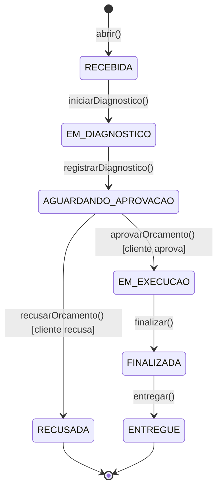

# Oficina Mecânica — Sistema Integrado de Atendimento e Execução de Serviços

Tech Challenge — Fase 1 (POS TECH / SOAT). MVP do back-end responsável pela gestão de
clientes, veículos, catálogo de serviços/peças e ordens de serviço (OS) de uma oficina
mecânica, aplicando **Domain-Driven Design**, arquitetura em camadas, autenticação JWT
e testes automatizados.

## Objetivo desta fase

Substituir o controle manual (planilhas/anotações) por um sistema único que permita:

- Abrir uma OS identificando cliente (CPF/CNPJ) e veículo, com os serviços/peças solicitados.
- Acompanhar o status da OS em tempo real (`Recebida → Em diagnóstico → Aguardando aprovação → Em execução → Finalizada → Entregue`, com `Recusada` como desfecho alternativo).
- Gerar o orçamento automaticamente e permitir que o cliente aprove ou recuse.
- Gerir o catálogo de clientes, veículos, serviços e peças, com controle de estoque.
- Medir o tempo médio de execução das OS finalizadas.

## Stack e justificativas técnicas

| Decisão | Motivo |
|---|---|
| **NestJS + TypeScript** | Estrutura modular que mapeia naturalmente para bounded contexts DDD, injeção de dependência nativa, Jest integrado. |
| **PostgreSQL + TypeORM** | O domínio é fortemente relacional (Cliente → Veículo → OS → Itens de Serviço/Peça) e depende de integridade referencial e transações ACID — em especial a baixa de estoque ao aprovar um orçamento, que precisa ser atômica mesmo sob concorrência (duas OS disputando a mesma peça). Postgres é gratuito, robusto, e tem ótimo suporte a Docker. |
| **JWT (`@nestjs/jwt` + Passport)** | Autenticação stateless para as rotas administrativas, conforme exigido pelo desafio. |
| **class-validator** | Validação declarativa dos DTOs, incluindo validadores customizados de CPF/CNPJ (dígito verificador) e placa (formato antigo e Mercosul). |
| **Swagger (`@nestjs/swagger`)** | Documentação OpenAPI gerada a partir do próprio código, sempre atualizada. |
| **Jest + Supertest** | Testes unitários (domínio/aplicação) e de integração (e2e, contra Postgres real). |

## Arquitetura

O projeto é um **monolito em arquitetura de camadas**, organizado por módulo (bounded
context). Cada módulo de negócio segue a mesma separação:

```
src/
  shared/                     Kernel compartilhado: Entity base, Value Objects (CPF/CNPJ, Placa),
                               exceções de domínio, filtro HTTP, validadores customizados.
  config/                     Configuração de ambiente e DataSource do TypeORM.
  modules/
    auth/                     Login administrativo, estratégia JWT, guard.
    clientes/                 domain / application / infrastructure / interfaces (http)
    veiculos/                 idem
    servicos/                 idem (catálogo de serviços)
    pecas/                    idem (catálogo + controle de estoque)
    ordens-servico/           Agregado central: máquina de estados da OS, orçamento,
                               orquestração da baixa de estoque.
```

Em cada módulo:

- **domain/** — entidades e Value Objects com as regras de negócio e invariantes; não depende de framework nem de banco.
- **application/** — casos de uso (services) que orquestram o domínio e os repositórios; ponto único onde a lógica de negócio é acionada.
- **infrastructure/** — implementação dos repositórios com TypeORM (mapeamento domínio ↔ tabela).
- **interfaces/http/** — controllers, DTOs e validação — a única camada que conhece HTTP/Swagger.

A regra de dependência é sempre **de fora para dentro**: `interfaces` depende de
`application`, que depende de `domain`; `infrastructure` implementa interfaces definidas
pelo `domain` (Dependency Inversion — cada módulo expõe um token de injeção, ex.
`CLIENTE_REPOSITORY`, e o domínio nunca importa TypeORM).

### Agregado `OrdemServico`

O coração do domínio. Toda transição de status passa exclusivamente pelos métodos da
entidade (`iniciarDiagnostico`, `registrarDiagnostico`, `aprovarOrcamento`,
`recusarOrcamento`, `finalizar`, `entregar`), que validam a máquina de estados e
recalculam o orçamento — garantindo que a OS nunca fique em um estado inconsistente,
independente de qual camada aciona a transição.



A baixa de estoque das peças ocorre de forma **transacional e atômica** no momento da
aprovação do orçamento (`PecaRepository.decrementarEstoqueTransacional`), usando um
`UPDATE ... WHERE quantidade_estoque >= :quantidade` dentro de uma transação — se o
estoque não for suficiente no exato momento da aprovação (por concorrência com outra
OS), a operação inteira é revertida e uma `InsufficientStockException` é lançada.

### Segurança

- Rotas administrativas (CRUD de clientes/veículos/serviços/peças, gestão de OS) exigem
  `Authorization: Bearer <JWT>`.
- Rotas voltadas ao cliente final (`GET /ordens-servico/:id/status`,
  `POST /ordens-servico/:id/aprovacao`) são públicas, mas exigem o CPF/CNPJ do cliente
  dono da OS como prova de posse — e têm rate limiting dedicado.
- Senhas de usuários administrativos são armazenadas com `bcrypt`.
- `helmet` + CORS habilitados; `ValidationPipe` global com `whitelist`/`forbidNonWhitelisted`.
- CPF/CNPJ e placa validados por algoritmo (dígito verificador / formato), não apenas por regex solto.

## Executando localmente

### Com Docker (recomendado)

```bash
cp .env.example .env
docker-compose up --build
```

A aplicação sobe em `http://localhost:3000`, com o Postgres em `localhost:5432`.
Documentação interativa (Swagger) em **http://localhost:3000/docs**.

Crie o usuário administrativo inicial (necessário para obter um JWT). O script de seed
roda localmente via `ts-node`, apontando para o Postgres exposto pelo compose na porta
5432:

```bash
DB_HOST=localhost ADMIN_EMAIL=admin@oficina.com ADMIN_PASSWORD=admin123 npm run seed:admin
```

### Sem Docker

Pré-requisitos: Node.js 20+, PostgreSQL 16 rodando localmente.

```bash
npm install
cp .env.example .env   # ajuste DB_HOST/DB_USERNAME/DB_PASSWORD conforme seu Postgres local
npm run seed:admin     # cria o usuário administrativo inicial
npm run start:dev
```

A aplicação usa `synchronize: true` fora de produção — o schema é criado
automaticamente a partir das entidades na primeira execução, sem necessidade de rodar
migrations manualmente.

### Autenticando

```bash
curl -X POST http://localhost:3000/auth/login \
  -H "Content-Type: application/json" \
  -d '{"email":"admin@oficina.com","senha":"admin123"}'
```

Use o `accessToken` retornado no header `Authorization: Bearer <token>` das chamadas
administrativas.

## Testes

```bash
npm test            # testes unitários (domínio + aplicação, com mocks)
npm run test:cov    # idem, com relatório de cobertura
npm run test:e2e    # testes de integração (requer Postgres — ex.: docker-compose up -d postgres)
```

Cobertura nos domínios críticos indicados pelo desafio (`ordens-servico` e `pecas`,
apenas `domain` + `application`, sem contar infraestrutura/HTTP): **acima de 95%** —
acima do mínimo de 80% exigido.

## Documentação complementar

- [`docs/ddd/`](docs/ddd) — Event Storming (fluxos de criação/acompanhamento da OS e
  gestão de peças/insumos) e Linguagem Ubíqua.
- [`docs/security/vulnerability-report.md`](docs/security/vulnerability-report.md) —
  relatório de análise de vulnerabilidades (`npm audit` + práticas adotadas).
- Swagger: `/docs` na aplicação em execução.

## Principais endpoints

| Método | Rota | Acesso | Descrição |
|---|---|---|---|
| POST | `/auth/login` | público | Autentica um usuário administrativo |
| POST/GET/PATCH/DELETE | `/clientes[/:id]` | JWT | CRUD de clientes |
| POST/GET/PATCH/DELETE | `/veiculos[/:id]` | JWT | CRUD de veículos |
| POST/GET/PATCH/DELETE | `/servicos[/:id]` | JWT | CRUD do catálogo de serviços |
| POST/GET/PATCH/DELETE | `/pecas[/:id]` | JWT | CRUD do catálogo de peças + estoque |
| PATCH | `/pecas/:id/estoque` | JWT | Ajuste manual de estoque |
| POST | `/ordens-servico` | JWT | Abre uma nova OS |
| GET | `/ordens-servico` | JWT | Lista/filtra OS por status (paginado) |
| GET | `/ordens-servico/:id` | JWT | Detalhamento completo da OS |
| PATCH | `/ordens-servico/:id/iniciar-diagnostico` | JWT | Inicia o diagnóstico |
| PATCH | `/ordens-servico/:id/diagnostico` | JWT | Registra diagnóstico e gera orçamento |
| PATCH | `/ordens-servico/:id/finalizar` | JWT | Finaliza a execução |
| PATCH | `/ordens-servico/:id/entregar` | JWT | Marca como entregue |
| GET | `/ordens-servico/metricas/tempo-medio` | JWT | Tempo médio de execução |
| GET | `/ordens-servico/:id/status?documento=` | público* | Cliente consulta o status da OS |
| POST | `/ordens-servico/:id/aprovacao` | público* | Cliente aprova/recusa o orçamento |

\* validado por CPF/CNPJ do cliente dono da OS, não por JWT — ver seção Segurança.

Especificação completa e testável: `/docs` (Swagger UI) na aplicação em execução.

## Limitações conhecidas / próximos passos

Este é o MVP da Fase 1. Escalabilidade dinâmica, Kubernetes, Terraform, API Gateway,
autenticação serverless e observabilidade avançada são objeto das fases seguintes do
Tech Challenge.
