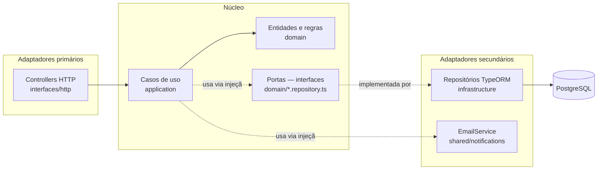
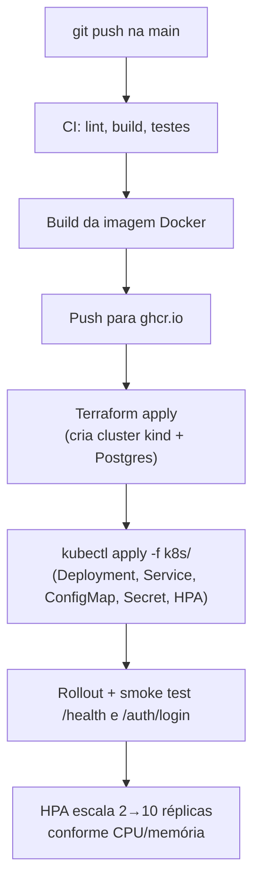

# Arquitetura (Fase 2)

## Por que Hexagonal (Ports & Adapters)

A Fase 1 já organizava cada módulo em `domain / application / infrastructure /
interfaces`, com toda dependência de infraestrutura (TypeORM) injetada por trás de
interfaces definidas pelo próprio domínio. Isso **já é**, na prática, Arquitetura
Hexagonal — a Fase 2 formaliza essa estrutura explicitamente em vez de reescrevê-la:
reescrever um código já testado (68 testes, >95% de cobertura nos domínios críticos)
apenas para renomear pastas teria custo sem benefício real de qualidade.

| Camada hexagonal | Pasta no projeto | Papel |
|---|---|---|
| **Domínio (núcleo)** | `modules/*/domain/` | Entidades, Value Objects, regras de negócio puras. Zero import de framework/ORM. |
| **Portas** | `modules/*/domain/*.repository.ts` | Interfaces que o domínio define e exige de fora (ex.: `ClienteRepository`, `OrdemServicoRepository`). |
| **Casos de uso** | `modules/*/application/` | Orquestram o domínio através das portas — é a única camada que conhece "o que fazer", nunca "como persistir" ou "como responder HTTP". |
| **Adaptador primário (driving)** | `modules/*/interfaces/http/` | Controllers/DTOs — traduzem requisições HTTP em chamadas aos casos de uso. |
| **Adaptador secundário (driven)** | `modules/*/infrastructure/` | Implementações concretas das portas (TypeORM). O domínio nunca importa daqui — é o inverso: a infraestrutura implementa o que o domínio pediu (Dependency Inversion, via tokens de injeção como `CLIENTE_REPOSITORY`). |

A regra é sempre a mesma: **setas de dependência apontam para dentro**. `interfaces`
depende de `application`, que depende de `domain`; `infrastructure` depende de
`domain` (para implementar as portas), nunca o contrário.

## Fluxo de deploy (Fase 2)

Ver [`.github/workflows/ci-cd.yml`](../.github/workflows/ci-cd.yml) para os passos
reais, [`/infra`](../infra) para o Terraform e [`/k8s`](../k8s) para os manifestos.
