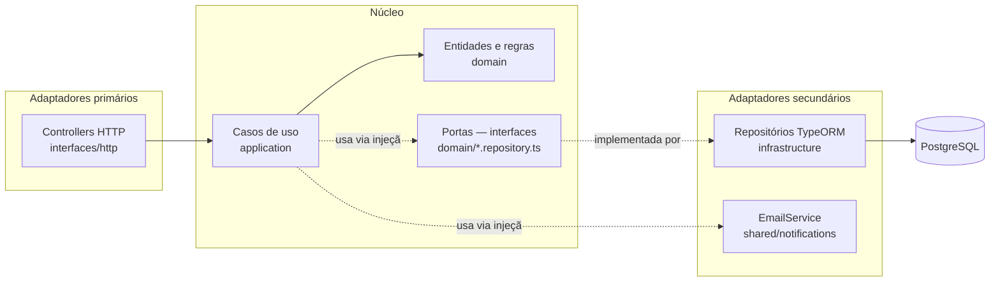
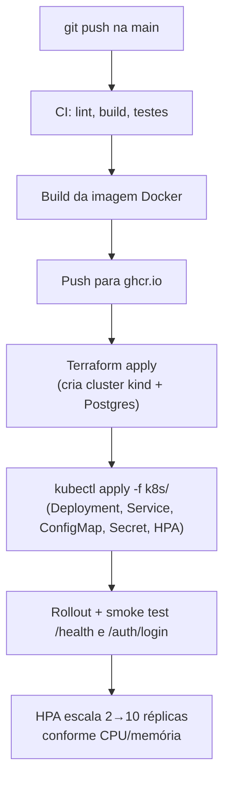
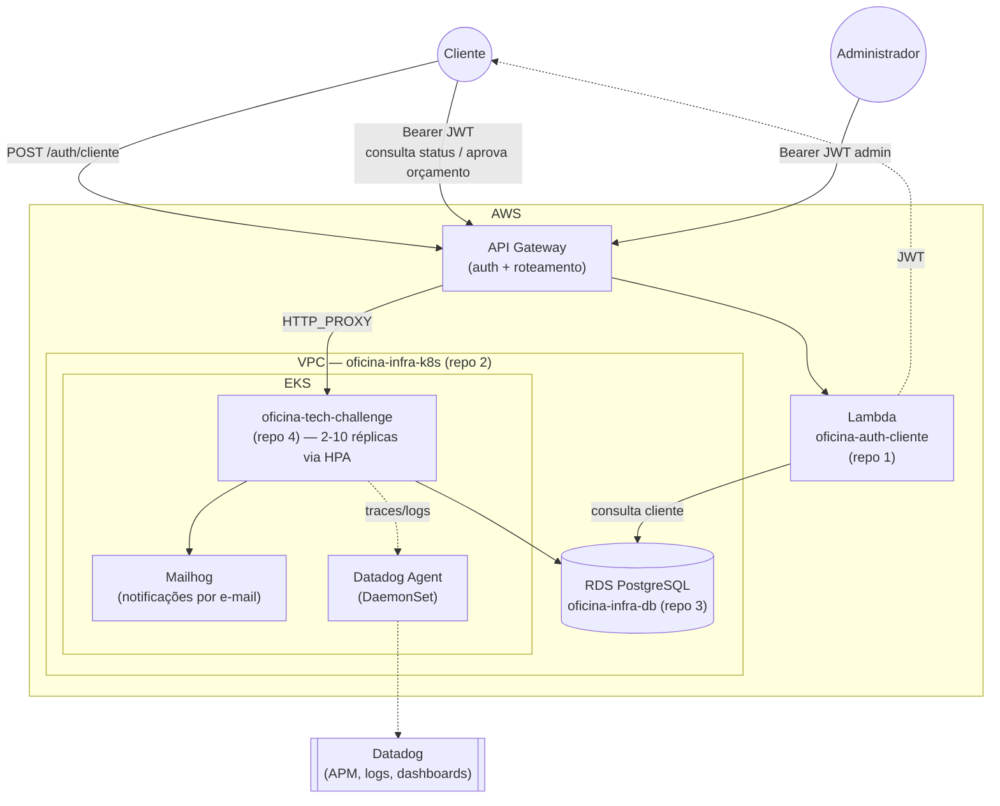

# Arquitetura (Fases 2 e 3)

## Por que Hexagonal (Ports & Adapters)

A Fase 1 já organizava cada módulo em `domain / application / infrastructure /
interfaces`, com toda dependência de infraestrutura (TypeORM) injetada por trás de
interfaces definidas pelo próprio domínio. Isso **já é**, na prática, Arquitetura
Hexagonal — a Fase 2 formaliza essa estrutura explicitamente em vez de reescrevê-la:
reescrever um código já testado (68 testes, >95% de cobertura nos domínios críticos)
apenas para renomear pastas teria custo sem benefício real de qualidade.

| Camada hexagonal | Pasta no projeto | Papel |
|---|---|---|
| **Domínio (núcleo)** | `modules/*/domain/` | Entidades, Value Objects, regras de negócio puras. Zero import de framework/ORM. |
| **Portas** | `modules/*/domain/*.repository.ts` | Interfaces que o domínio define e exige de fora (ex.: `ClienteRepository`, `OrdemServicoRepository`). |
| **Casos de uso** | `modules/*/application/` | Orquestram o domínio através das portas — é a única camada que conhece "o que fazer", nunca "como persistir" ou "como responder HTTP". |
| **Adaptador primário (driving)** | `modules/*/interfaces/http/` | Controllers/DTOs — traduzem requisições HTTP em chamadas aos casos de uso. |
| **Adaptador secundário (driven)** | `modules/*/infrastructure/` | Implementações concretas das portas (TypeORM). O domínio nunca importa daqui — é o inverso: a infraestrutura implementa o que o domínio pediu (Dependency Inversion, via tokens de injeção como `CLIENTE_REPOSITORY`). |



A regra é sempre a mesma: **setas de dependência apontam para dentro**. `interfaces`
depende de `application`, que depende de `domain`; `infrastructure` depende de
`domain` (para implementar as portas), nunca o contrário.

## Fluxo de deploy (Fase 2)



Ver [`.github/workflows/ci-cd.yml`](../.github/workflows/ci-cd.yml) para os passos
reais, [`/infra`](../infra) para o Terraform e [`/k8s`](../k8s) para os manifestos.

## Fase 3 — operação corporativa: 4 repositórios, nuvem real

A Fase 3 eleva o sistema a "operação corporativa": autenticação de clientes por CPF
via uma Function Serverless, infraestrutura em nuvem real (AWS), e o projeto
organizado em 4 repositórios independentes, cada um com seu próprio CI/CD:

| # | Repositório | Responsabilidade |
|---|---|---|
| 1 | `oficina-lambda-auth` | Function Serverless (Lambda + API Gateway) de autenticação por CPF/CNPJ |
| 2 | `oficina-infra-k8s` | Terraform: VPC + cluster Kubernetes gerenciado (EKS) |
| 3 | `oficina-infra-db` | Terraform: banco de dados gerenciado (RDS PostgreSQL) |
| 4 | `oficina-tech-challenge` | Este repositório: aplicação principal, executando no EKS |

Os 4 repositórios Terraform (1, 2, 3, e o deploy do 4) se integram via **AWS SSM
Parameter Store** — ver [ADR 0006](adr/0006-ssm-para-integracao-entre-repos.md) para o
porquê dessa escolha em vez de `terraform_remote_state` direto.

### Diagrama de Componentes (visão de nuvem completa)



### Diagrama de Sequência — autenticação + abertura de OS

```mermaid
sequenceDiagram
    participant Admin
    participant Cliente
    participant APIGW as API Gateway
    participant Lambda as oficina-lambda-auth
    participant App as oficina-tech-challenge
    participant RDS as PostgreSQL (RDS)

    Admin->>App: POST /auth/login (email, senha)
    App-->>Admin: 200 { accessToken admin }

    Admin->>App: POST /ordens-servico (Bearer admin)<br/>{ clienteId, veiculoId, servicos, peças }
    App->>RDS: valida cliente/veículo, resolve catálogo
    App->>RDS: INSERT ordens_servico (status=RECEBIDA)
    App-->>Admin: 201 { id, status: "RECEBIDA" }

    Note over Cliente,RDS: mais tarde, o cliente quer acompanhar a OS
    Cliente->>APIGW: POST /auth/cliente { documento }
    APIGW->>Lambda: invoke
    Lambda->>RDS: SELECT cliente WHERE documento = ?
    Lambda-->>Cliente: 200 { accessToken cliente }

    Cliente->>APIGW: GET /ordens-servico/:id/status (Bearer cliente)
    APIGW->>App: proxy
    App->>App: ClienteAuthGuard valida token; confere clienteId dono da OS
    App-->>Cliente: 200 { status, valorTotal, ... }
```
