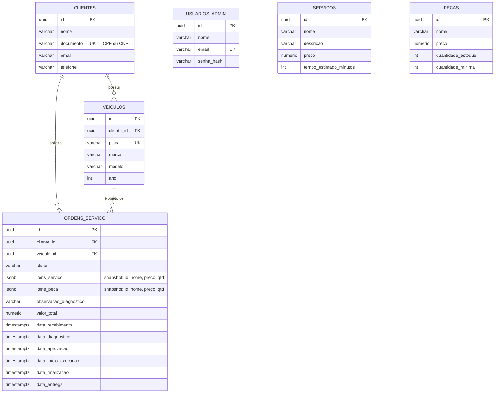

# Modelo de dados — Diagrama ER e justificativa

## Justificativa formal da escolha do banco (RDS PostgreSQL)

Ver [RFC 0002](../rfc/0002-banco-gerenciado.md) para a análise completa das
alternativas. Resumo: o domínio é fortemente relacional — `OrdemServico` referencia
`Cliente` e `Veiculo`, e carrega os itens de serviço/peça consumidos; a baixa de
estoque de uma peça precisa ser atômica mesmo sob concorrência entre duas OS disputando
a mesma peça (`PecaRepository.decrementarEstoqueTransacional`, com `UPDATE ... WHERE
quantidade_estoque >= :quantidade` dentro de uma transação). Um banco relacional com
transações ACID é o ajuste natural — nenhuma engine NoSQL considerada oferecia esse
nível de garantia sem desnormalização que comprometeria a integridade dessas regras.

## Ajustes no modelo desde a Fase 1

- **Fase 1:** schema inicial, criado via `synchronize` do TypeORM a partir das
  entidades (sem migrations — MVP).
- **Fase 2:** nenhuma mudança de schema; `ordens_servico.itens_servico` e
  `itens_peca` já eram `jsonb` desde o início (armazenam um *snapshot* imutável do
  preço/nome do item no momento em que foi adicionado à OS — decisão deliberada: o
  preço de um serviço/peça pode mudar no catálogo depois que uma OS antiga já foi
  fechada, e a OS não deve ser afetada retroativamente).
- **Fase 3:** nenhuma mudança de schema — a autenticação por CPF (Lambda) apenas lê a
  tabela `clientes` existente; o `JWT_SECRET` passou a ser compartilhado via SSM
  Parameter Store (Fase 3) em vez de gerado localmente por instância.

## Diagrama Entidade-Relacionamento

### Por que `itens_servico`/`itens_peca` são `jsonb`, não tabelas associativas

Decisão deliberada desde a Fase 1, reavaliada e mantida na Fase 3: uma tabela
associativa clássica (`ordem_servico_itens_servico` com FK para `servicos`) exigiria
que o preço histórico fosse buscado indiretamente ou duplicado em uma coluna própria —
o `jsonb` já armazena o *snapshot* completo (id do catálogo + nome + preço no momento
+ quantidade) de forma atômica com o resto da OS, sem exigir uma segunda tabela nem
lógica extra para "preço na época". O trade-off aceito: consultas agregadas across
todas as OS por peça/serviço (ex.: "quantas vezes o serviço X foi vendido") exigem
`jsonb` querying em vez de um `JOIN` simples — não há esse requisito hoje; se surgir,
é candidato a uma tabela de fatos derivada (ex.: view materializada), não a uma
mudança no modelo transacional.
