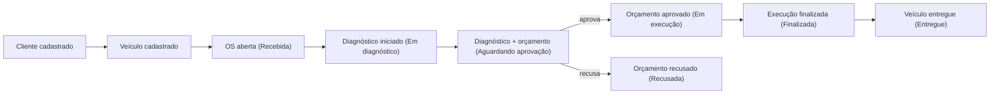
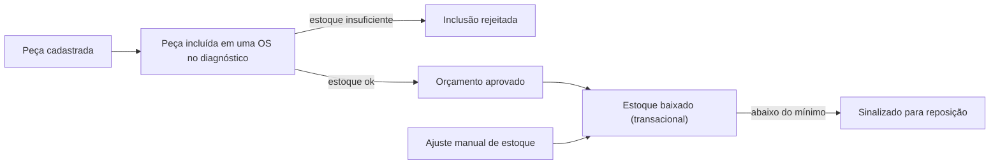

# Event Storming

Roteiro completo dos dois fluxos pedidos no desafio, na notação padrão de Event
Storming (comando → evento → política/reação → próximo comando). Pode ser transcrito
diretamente para um board Miro/Mural (mantendo as cores indicadas) ou usado como está,
já que a atividade aceita "Miro ou equivalente".

**Legenda de cores:**
🟧 Evento de Domínio (passado) · 🟦 Comando · 🟨 Ator · 🟪 Agregado · 🟩 Read Model · 🟥 Política/Reação automática · ⬛ Sistema externo

---

## Fluxo 1 — Criação e acompanhamento da OS

| 🟨 Ator | 🟦 Comando | 🟪 Agregado | 🟧 Evento de Domínio | 🟥 Política (reação automática) |
|---|---|---|---|---|
| Atendente | Cadastrar Cliente | Cliente | **ClienteCadastrado** | — |
| Atendente | Cadastrar Veículo | Veículo | **VeiculoCadastrado** | — |
| Atendente | Abrir Ordem de Serviço | OrdemServico | **OrdemDeServicoAberta** (status=`Recebida`) | — |
| Mecânico | Iniciar Diagnóstico | OrdemServico | **DiagnosticoIniciado** (status=`Em diagnóstico`) | — |
| Mecânico | Registrar Diagnóstico (serviços/peças adicionais + observação) | OrdemServico | **DiagnosticoRegistrado**, **OrcamentoGerado** (status=`Aguardando aprovação`) | 🟥 Ao gerar o orçamento, notificar o cliente (e-mail/consulta via API) |
| Cliente | Aprovar Orçamento | OrdemServico | **OrcamentoAprovado** (status=`Em execução`) | 🟥 Disparar baixa de estoque das peças da OS (transacional) |
| Cliente | Recusar Orçamento | OrdemServico | **OrcamentoRecusado** (status=`Recusada`) | — |
| Mecânico | Finalizar Execução | OrdemServico | **ExecucaoFinalizada** (status=`Finalizada`) | 🟥 Disponibilizar OS para retirada; contabilizar tempo de execução |
| Atendente | Entregar Veículo | OrdemServico | **VeiculoEntregue** (status=`Entregue`) | — |

**🟩 Read Models envolvidos:** `ConsultaStatusOS` (cliente consulta por CPF/CNPJ + id da
OS), `ListagemDeOrdensDeServico` (atendente acompanha o fluxo do dia), `TempoMedioDeExecucao`.

**Hotspots identificados (decisões de negócio relevantes):**

- *E se o cliente não responder à aprovação do orçamento?* → Fase 1 mantém a OS em
  `Aguardando aprovação` indefinidamente (sem SLA automático); é um ponto de evolução
  natural para as fases seguintes (ex.: expiração automática).
- *E se duas OS concorrentes disputarem a mesma peça em estoque?* → resolvido: a baixa
  de estoque na aprovação é atômica (transação de banco com checagem de quantidade
  disponível), garantindo que a segunda aprovação falhe com estoque insuficiente em vez
  de deixar o estoque negativo.

---

## Fluxo 2 — Gestão de peças e insumos

| 🟨 Ator | 🟦 Comando | 🟪 Agregado | 🟧 Evento de Domínio | 🟥 Política (reação automática) |
|---|---|---|---|---|
| Estoquista | Cadastrar Peça | Peca | **PecaCadastrada** | — |
| Estoquista | Atualizar Dados da Peça (preço, nome, estoque mínimo) | Peca | **PecaAtualizada** | — |
| Estoquista | Ajustar Estoque (entrada manual / correção) | Peca | **EstoqueAjustado** | 🟥 Se resultado < estoque mínimo → sinalizar reposição necessária (`estaAbaixoDoMinimo`) |
| Mecânico (via Diagnóstico) | Incluir Peça na OS | OrdemServico | **PecaIncluidaNaOS** | 🟥 Validar, no momento da inclusão, se há estoque suficiente — senão rejeitar o item |
| Sistema (reação a **OrcamentoAprovado**) | Baixar Estoque das Peças da OS | Peca | **EstoqueBaixado** | 🟥 Se alguma peça não tiver mais estoque suficiente no instante da aprovação → toda a operação falha (nenhuma peça é baixada) e a OS não avança |
| Estoquista | Remover Peça do Catálogo | Peca | **PecaRemovida** | — |

**🟩 Read Models envolvidos:** `CatalogoDePecas` (com indicador `abaixoDoMinimo`),
`HistoricoDeMovimentacaoDeEstoque` (implícito nas OS que consumiram cada peça).

**Hotspots identificados:**

- *Reserva vs. baixa efetiva:* optou-se por **não** reservar estoque no momento do
  diagnóstico (apenas validar disponibilidade), e baixar de fato apenas na aprovação do
  orçamento — evita "travar" estoque para orçamentos que podem nunca ser aprovados.
- *Concorrência:* a baixa é feita com uma instrução `UPDATE` condicional
  (`WHERE quantidade_estoque >= quantidade`) dentro de uma transação, e não por um
  ciclo leitura-cálculo-escrita em memória — elimina a condição de corrida entre duas
  OS que disputam a mesma peça sem precisar de lock explícito.

