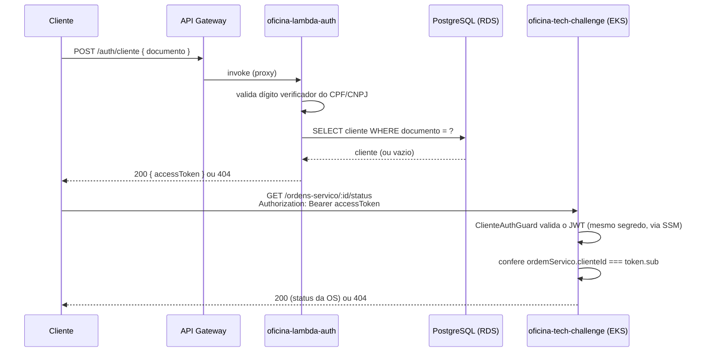

# RFC 0003 — Estratégia de autenticação de clientes

**Autor:** equipe do projeto · **Status:** Implementado (ver [ADR 0003](../adr/0003-autenticacao-serverless.md))

## Motivação

Nas Fases 1/2, as rotas de consulta de status e aprovação de orçamento validavam o
CPF/CNPJ do cliente **a cada requisição** (query param/body), sem conceito de sessão.
A Fase 3 exige explicitamente uma Function Serverless dedicada que valide o CPF,
consulte a existência/status do cliente, e emita um JWT — um modelo de autenticação
mais próximo de "login" do que de "prova pontual".

## Alternativas consideradas

### Validação de CPF por requisição (modelo atual das Fases 1/2)

- Simples, sem estado, sem necessidade de infraestrutura adicional.
- Descartada como único mecanismo na Fase 3 porque não atende ao requisito explícito
  (Function Serverless + JWT) e porque exige revalidar o algoritmo de CPF a cada
  chamada, espalhando essa responsabilidade pelo app principal em vez de concentrá-la
  em um único ponto de entrada.

### JWT emitido por uma Function Serverless dedicada (escolhida)

- Atende ao requisito literalmente: `POST /auth/cliente` na Lambda valida o CPF,
  consulta o RDS, e devolve um token de curta duração.
- O app principal só precisa validar a assinatura do token (`ClienteJwtStrategy`) —
  não reimplementa a lógica de consulta/validação de CPF, apenas confia no claim
  `sub` (clienteId) já validado pela Lambda.
- Simetria com o fluxo administrativo: dois guards JWT independentes
  (`JwtAuthGuard` para admin, `ClienteAuthGuard` para cliente), mesma abstração,
  audiências diferentes (claim `tipo`).

### Sessão com cookie/estado no servidor

- Descartada: exigiria armazenamento de sessão (Redis ou equivalente), infraestrutura
  adicional sem benefício claro para o padrão de uso (consultas pontuais e
  espaçadas, não uma sessão de navegação longa e contínua).

## Proposta e fluxo

## Decisão

Implementar conforme descrito — ver [ADR 0003](../adr/0003-autenticacao-serverless.md)
para as consequências detalhadas e o README do repositório `oficina-lambda-auth`
(repositório 1/4 do Tech Challenge) para a especificação completa do endpoint
`POST /auth/cliente`.
